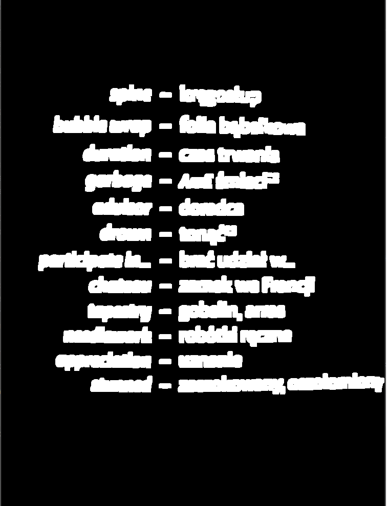

# Langi Django App

Langi is an application designed to help its users develop their language skills in a fun and convenient way. It uses one of the most popular SRS (Spaced Repetition System) algorithms for learning the previously created flashcards. Apart from adding new flashcards, users can import files to automatically create entire sets of words. The application supports both text document files and image files such as PNG and JPG. Featured mini-games, make learning new words and expressions entertaining. Langi’s interface is available in 16 languages and 2 color modes - the default "light" mode, and the optional "dark" mode, which is particularly useful when using the application at night. Other functionalities include the system of virtual keyboards, the audio recording option (used to save the pronunciation of a new word), the auto-translation with Google Translate API and learning statistics. The application was created with Django technology, Django REST framework, and OpenCV-Python library. 


## App's features:
*  Creating a user account, logging in to the application and resetting the password by sending the appropriate link to the e-mail address provided during registration;
* Changing a user interface language (the available languages are **English**, **German**, **Polish**, **Czech**, **Spanish**, **French**, **Italian**, **Lithuanian**, **Dutch**, **Portuguese**, **Turkish**, **Russian**, **Traditional Chinese**, **Japanese**, **Korean**, **Greek**);
* Changing an application theme between light and dark;
* Adding new decks by specifying the deck name and optional tags;
* Editing name and tags, delete and preview basic deck informations;
* Adding new flashcards to the selected deck. As part of the flashcard, we have the option of adding text to be on both sides of the card (front / back), adding up to three example sentences, adding an image and recording a sound using the user's microphone;
* Removing cards and viewing them within a specific deck, eg as a function available from the "Dictionary" level;
* Searching a deck by name or tag, or searching for a given word in the currently viewed deck;
* Translating entered text using the Google Translate API;
* Virtual keyboards, available for 47 languages;
* System (algorithm) that allows you to properly combine Korean letters, the so-called Jamo, into syllables that are part of the Hangul alphabet;
* Importing word sets from text document files;
* Automatic creation of flashcards from imported image files by using image processing algorithms;
* Learning words and phrases using two mini-games, ie Snake (a modified version that includes words) and Drag\&Drop;
* Standard method of learning words and phrases using the SRS algorithm;
* The ability to track the learning statistics created in the form of bar charts and tables.

 
 

## Some extra screenshots:

|  |  |
| ----------------------------------------- | --------------------------------------- |

|  |  |
| ----------------------------------------- | --------------------------------------- |

|  |  |
| ----------------------------------------- | --------------------------------------- |

 
 

## Text detection using OpenCV library:

<p align="center">

<p>

<p align="center">

<p>

<p align="center">
<p>

&nbsp;
&nbsp;

## Used tools and technologies:
* Python 3.8.1
* Django Framework 3.0.4
* Django REST framework 3.11.0
* OpenCV-Python 4.2
* NumPy 1.19.0
* Pillow 7.1.2
* JavaScript + jQuery 3.5.1
* p5.sound.js 0.7.2
* slick.js (jQuery plugin) 1.8.1
* Chart.js 2.8.0
* HTML 5.1
* Sass (Sassy CSS)

&nbsp;
&nbsp;

## Used tools and technologies:

To run it locally create a virtual environment by yourself and install the necessary dependencies (see the file requirements.txt). If you want to properly display user interface in all languages, you should download the appropriate fonts (for asian languages):

Noto Sans CJK JP - https://www.google.com/get/noto/#sans-jpan
Noto Sans CJK KR - https://www.google.com/get/noto/#sans-kore
Noto Sans CJK TC - https://www.google.com/get/noto/#sans-hant

After downloading each of the above packages, decompress the .zip file, and then copy the files with the .otf extension (exactly Bold, DemiLight, Light, Medium, Regular and Thin fonts) according to:

```bash
\langi\management\static\management\fonts\NotoSansCJKJP
\langi\management\static\ management\fonts\NotoSansCJKKR
\langi\management\static\management\fonts\NotoSansCJKTC
```

Creating a Virtual Environment and Installing Dependencies on Windows 10:

1. Make sure you have the correct Python distribution installed, preferred version is at least 3.8. Then add it to the PATH variable on your system.
1. Create a virtual environment and install the necessary dependencies:
* at the level of the folder where the application code is located, i.e. the *\langi* folder, execute:

    ```bash
    python -m venv LangiProjectEnv
    ```
* start the virtual environment with the command:

    ```bash
    LangiProjectEnv\Scripts\activate
    ```
(Note: You may need to run Windows PowerShell with the "Run as Administrator" option)
* install the necessary dependencies:

    ```bash
    pip install -r requirements.txt
    ```
    (Note: make sure you have the latest version of pip, the software we use to install dependencies (including the Django framework):
    ```bash
    python3 -m pip install --upgrade pip
    ```

For other operating systems it looks similarly. For more information, check the link below:
https://docs.python.org/3/tutorial/venv.html


TO LAUNCH THE LOCAL SERVER OF THE APPLICATION, GO TO FOLDER *\Langi* AND EXECUTE:
```bash
python manage.py runserver
```